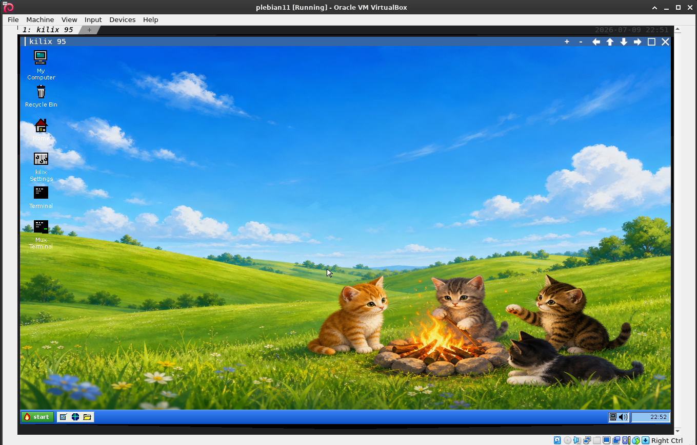

# Kilix 95

A Windows 95-style desktop rendered as **pixels** inside a Kilix pane, with an
optional Windows XP-style flavor.

Kilix 95 is not a window manager for the host X session. It is a Python desktop
surface that draws a complete desktop into a PIL framebuffer, sends that
framebuffer through the Kitty graphics protocol, and routes terminal keyboard
and mouse input back into its own widgets, windows, menus, and apps.

The normal entry point is:

```bash
kilix desktop
```

Quit through Start -> Shut Down..., or press `Ctrl+Alt+Q`.

## Release 0.1.4

Version 0.1.4 consumes the Kilix 1.4 provider SDK and stores internal shell and
Briefcase records through `kilix_sdk.state`, backed by the host-pinned
`kilix-state-py` binding and native `kilix-state` library. Existing JSON records
are imported when a native record is absent and retained as recovery copies.

## Release 0.1.3

Version 0.1.3 consumes the Kilix 1.3 provider SDK: the shared immutable
content catalog drives Games, and `kilix_sdk.xapp.XAppSession` owns private X
display authentication, app/capture processes, event-driven capture fallback,
input injection, and teardown. Kilix JPAK, Kilix Rancher, and Kilix Pong arrive
through the shared catalog without separate provider-specific installers. The
shared chrome contract also exposes Kilix's volume widget in Settings.

## Release 0.1.2

Version 0.1.2 includes:

- canonical source discovery under `~/gpu_terminal` and Kilix 95-owned runtime
  state under `~/.local/gpu_terminal/kilix-95`;
- private session frames and ephemeral installer logs, plus a fully isolated
  test environment;
- a larger classic shell with Control Panel applets, Display Properties,
  Device Manager, Network Neighborhood, Dial-Up Networking, Printers,
  My Briefcase, PowerToys, and the safe disk-map theater;
- original Plus!-style themes, additional screen savers, Quick Launch, and the
  kitten-fire wallpaper reserved for the Windows XP flavor;
- Chess Bash and Kilix Fishtank integrations plus a repaired, immutable
  Kilix-Amp install with private XDG config, data, state, and cache roots;
- a Help-menu Pleb Recovery Guide that opens the installed recovery document
  and supplies actionable `sudo` dependency repair advice when it is missing;
  and
- unique private transport files for every streamed frame, deferred retirement
  until the terminal engine has consumed them, and startup orphan reaping that
  bounds frame/cache churn and prevents delayed AMP-session `SIGBUS` crashes.

## Release 0.1.1

Version 0.1.1 declares the provider/SDK contract, preserves the default-password
security baseline across provider choices, writes settings only to XDG user
configuration, and pins optional downloaded game/app sources to immutable
commits with safe archive extraction.

## Quick Start

From a normal Kilix session:

```bash
kilix desktop
```

For local development from this checkout:

```bash
cd ~/gpu_terminal/kilix-95
KILIX_HOME=~/gpu_terminal/kilix python3 main.py
```

For screenshot/test rendering without taking over the terminal:

```bash
KILIX_HOME=~/gpu_terminal/kilix \
  python3 main.py --screenshot /tmp/shot.png --scene all
```

Useful screenshot scenes:

```text
desktop start filemgr notepad settings dialog launcher menu startup shutdown bsod all
```

## Relationship To Kilix

Kilix 95 is the authoritative desktop-provider checkout, intentionally hosted
by Kilix. The copy bundled in Kilix is a compatibility fallback; the launcher
reports which one it selected instead of silently preferring a divergent tree.
The Kilix launcher passes `KILIX_HOME` so this repo can use the host SDK and
launch helpers. If `KILIX_HOME` is unset, `host.py` checks
`${GPU_TERMINAL_SOURCE_HOME:-~/gpu_terminal}/kilix`, then the sibling
`../kilix` checkout. Its final fallback is the canonical source-root path.

The boundary is:

- `kilix_sdk.term`: raw mode and terminal input parsing.
- `kilix_sdk.graphics`: inline Kitty graphics for streamed sessions.
- `kilix_sdk.state`: bounded, CRC-checked, crash-safe internal state records.
- Kilix CLI helpers: `kilix run`, `kilix browse`, `kilix serve`.
- Kitty remote control: `kitten @ launch` for new tabs and windows.

`provider.json` declares provider API 1, the required `kilix_sdk` 1.4 contract,
and the security behaviors the provider implements. Kilix validates that
data-only manifest and its implementation markers before executing the
provider. `main.py` also calls `kilix_sdk.require_compatible("1.4")` as a
defense-in-depth runtime check. Incompatible hosts fail early with a clear
version error.

Everything specific to the desktop lives here: the shell, taskbar, window
manager, widgets, built-in apps, Help, System Manual browser, games registry,
and tests.

## How Rendering Works

The desktop owns a single RGB framebuffer. On every dirty frame it draws:

1. the wallpaper and desktop icons;
2. normal and modal windows;
3. the taskbar;
4. menus, switcher overlays, tooltips, and cursor;
5. startup/shutdown/BSOD system screens when active.

The framebuffer is blitted through the Kitty graphics protocol:

- Local Kilix sessions write frame bytes to private files under
  `~/.local/gpu_terminal/kilix-95/session` and place them with Kitty `t=t`.
- Streamed `kilix serve` sessions use inline `t=d` when `KILIX_STREAM=1`.
- tmux passthrough is handled when `KILIX_STREAM=1` and `TMUX` are set.

Input uses the Kitty keyboard protocol plus SGR-pixel mouse reporting
(`?1003h` and `?1016h`). Mouse coordinates therefore map directly onto
framebuffer pixels.

Rendering is damage-driven. The event loop repaints only when something marks
the desktop dirty: input, resize, clock tick, caret blink, window/app updates,
screen saver changes, or periodic keepalive.

## Main Modules

| file | role |
|---|---|
| `main.py` | entry point, `Desk`, raw-mode lifecycle, input dispatch, render loop, blitting, screenshots |
| `theme.py` | Win95/XP identity, palettes, metrics, fonts, bevel primitives |
| `icons.py` | original pixel icons drawn on a 16x16 grid |
| `widgets.py` | retained widget toolkit: buttons, fields, text areas, lists, grids, menus, tabs, scrollbars |
| `wm.py` | window chrome, z-order, focus, modality, move/resize, dialogs |
| `taskbar.py` | Start menu, Help/System/Find menus, task buttons, quick launch, tray, clock |
| `shell.py` | desktop surface, launcher files, file associations, spawn verbs, browser/default-browser paths |
| `xdgapps.py` | freedesktop `.desktop` discovery and Start menu grouping |
| `games.py` | Games registry, on-demand installers, CLI launcher |
| `recycle.py` | recycle-bin backing store |
| `clipboard.py` | clipboard hub across desktop widgets, host X, and XPane displays |
| `vbox.py` | VirtualBox launcher detection and VM command construction |
| `apps/` | built-in windows such as File Manager, Settings, Help, System Manual, Notepad, Paint, WordPad, XPane |

Input dispatch order is:

```text
Desk -> MenuHost | drag owner | active/window hit | taskbar | shell
```

Windows capture the pressed widget until release. That is why buttons,
scrollbars, text selections, window drags, and list gestures keep working even
when the pointer moves during a drag.

## Start Menu

The Start menu is built in `taskbar.py`.

Top-level sections:

- **Programs**: built-in accessories, games, browsers, terminals, Kilix Temps,
  Tmux Manager, the MS-DOS Prompt/DOSBox caller, user launchers, and discovered XDG apps. PowerToys and
  the optional classic folders appear when the full experience is active.
- **Documents**: recently opened files.
- **Settings**: Control Panel, Kilix settings, display properties, sound
  schemes, and desktop flavor.
- **Help**: Help Topics, project how-tos, terminal how-tos, System Manual.
- **System**: update and maintenance entries when the relevant helpers exist.
- **Find**: file search.
- **Run**: command launcher.
- **Shut Down**: shutdown, restart, exit-to-terminal, update-and-restart.

The menu is data-driven through `widgets.MenuItem`, so submenus can be nested
without new widget code.

## Windows 95 Nostalgia Features

Kilix 95 starts with a lean desktop. Select **Activate full experience** in
kilix Settings -> Behavior to expose the optional nostalgia layer. The choice
is saved in desktop state and applied immediately; no restart is needed.

The classic additions are functional, with host-facing behavior kept read-only
or explicitly user-triggered:

- Control Panel and five-tab Display Properties cover original themes,
  wallpaper patterns, sound/pointer schemes, eight screen savers, local
  password protection, and RTM/Plus!/late-Win9x/Kilix-XP presentation profiles.
- My Computer includes a not-ready floppy, mounted removable media, a managed
  read-only Kilix 95 CD-ROM, Control Panel, Printers, Dial-Up Networking,
  Network Neighborhood, My Briefcase, and Recycle Bin.
- Network Neighborhood maps configured SSH aliases to real SSH tabs and
  explicitly configured local shares to File Manager. Dial-Up Networking
  stages an original modem sound before handing off to the normal browser; it
  never changes host networking.
- Device Manager and Add New Hardware inspect hardware without mounting disks
  or installing drivers. Printers discovers CUPS queues read-only and supports
  virtual print-to-folder destinations.
- My Briefcase performs non-destructive two-folder synchronization: deletions
  are not propagated and two-sided conflicts are never overwritten. Send To
  uses non-overwriting copies.
- PowerToys supplies Command Prompt Here, Explore From Here, QuickRes,
  DeskMenu, Send To settings, TweakUI, Round Clock, and a safe disk-map theater
  that never rearranges host data.

With the full experience disabled, Briefcase, dial-up/modem theater, Network
Neighborhood, Printers, PowerToys, hardware/defrag tools, the fake floppy and
managed CD-ROM, Send To additions, device notifications, and first-run Welcome
stay out of the desktop and menus.

Classic interaction details include keyboard menu accelerators, outline-only
window dragging, minimize/restore animation, configurable pointers, a busy
hourglass, Quick Launch, device and connection tray indicators, property
sheets, and first-run Welcome/Did You Know help.

## Help And Manuals

Start -> Help contains:

- **System Manual**: searchable browser for installed man pages.
- **List**: opens the System Manual browser with the full local man-page list.
- **Pleb Recovery Guide**: opens `/usr/local/share/doc/pleb/RECOVERY.md`, falling
  back to `$GPU_TERMINAL_SOURCE_HOME/pleb/docs/RECOVERY.md` for source runs.
- **Kilix**: how-tos for Kilix, Kilix 95, Pleb, and Plebian-OS.
- **Terminal**: how-tos for terminal basics, tmux, and bash.
- **Help Topics**: the general two-pane desktop guide.

The System Manual browser scans the active manpath, lists entries as
`name (section)`, and renders the selected page in a read-only text pane.
It uses `man <section> <name>` with pager output disabled, then strips terminal
formatting so the result is readable in the desktop text widget.

Blue underlined Help links are live links. They call
`Shell.open_default_browser_tab()`, which tries:

1. `xdg-open`
2. `sensible-browser`
3. `gio open`

The opener runs inside a filled Kilix tab. This is deliberately separate from
launcher URL files and Start -> Programs -> Web Browser, which continue to use
the Kilix browser flow.

Current built-in Help link targets include:

- Kilix repository
- Kilix 95 repository
- Pleb repository
- Plebian-OS repository
- GNU Bash manual
- Bash source repository
- tmux project
- tmux manual
- Linux man-pages project

## Launch Modes

Kilix 95 has several launch paths, each with a different containment model.

| mode | used by | behavior |
|---|---|---|
| `tab` | terminal apps, launcher default | `kitten @ launch --type=tab` |
| `window` | launcher option | `kitten @ launch --type=os-window` |
| `run` | X11 apps | `kilix run COMMAND` in a Kilix tab |
| `fullscreen` | X11 app launcher option | XPane fullscreen-sized app window |
| `browse` | URL launcher files, Chromium tab mode | `kilix browse URL` |
| default browser | Help links | `xdg-open`/`sensible-browser`/`gio open` in a tab |

Firefox defaults to a filled `kilix run` tab so it stays contained in the
terminal pane. Chromium defaults to the Kilix browser path in tab mode because
GUI Chromium can be fragile under software rendering.

VirtualBox is special-cased. `.vbox` files and VirtualBox `.desktop` entries
open through `kilix run --refit-windows` so the VM window stays contained.

## Desktop Folder And Launchers

The desktop folder is:

```text
~/.local/gpu_terminal/kilix-95/data/desktop
```

Override it with:

```bash
KILIX_DESKTOP_DIR=/path/to/desktop kilix desktop
```

Real files and directories in this folder appear as icons. `.desktop` files,
including those created by **Create Launcher...**, appear as shortcuts.

Launcher example:

```ini
[Desktop Entry]
Type=Application
Name=htop
Exec=htop
Path=~/
Icon=terminal
X-Kilix-Open=tab
```

Supported `X-Kilix-Open` values:

- `tab`: run in a Kilix tab.
- `window`: run in a Kilix OS window.
- `run`: run an X11 app through `kilix run`.
- `fullscreen`: run as a full-desktop XPane window.
- `browse`: open a URL through `kilix browse`.

For URL launchers:

```ini
[Desktop Entry]
Type=Link
Name=Project page
URL=https://example.invalid/
Icon=browser
```

## Built-In Apps

Built-in apps are `wm.Window` subclasses opened through `apps.open(desk, name)`.
The shell catches app-launch exceptions and shows an error dialog, so a broken
app should not take down the desktop.

Notable apps:

| app | purpose | notes |
|---|---|---|
| File Manager | folder browsing and file operations | opens directories, routes files through shell associations, and supports context menus |
| Notepad | plain text editing | uses the shared text area widget and file dialogs |
| WordPad | richer document editing | targets `.krt` and RTF-style content |
| Paint | bitmap editing | useful for quick pixel/image edits inside the desktop |
| Viewer | image display | opens supported image files through Pillow |
| Amp | media playback front end | pairs with the sound scheme controls and external media helpers |
| Sound Control Panel | UI sound scheme editor | saves schemes under user data, not the repo |
| Settings | Kilix/Kitty configuration editor | writes `kitty.conf` plus shared top-bar/pane-button settings and attempts live reload |
| Control Panel / Display Properties | classic settings namespace | themes, patterns, pointers, screen savers, compatibility profiles |
| My Computer | machine namespace | drives, removable media, virtual CD, and system folders |
| Network Neighborhood / Dial-Up | connection theater and launchers | SSH/local shares plus a browser hand-off; no host network mutation |
| Printers / Device Manager | host service inspection | read-only discovery plus safe virtual-printer setup |
| My Briefcase | two-folder synchronization | no deletion propagation or two-sided-conflict overwrite |
| PowerToys / Disk Defragmenter | shell conveniences and disk-map theater | configuration helpers; the disk is never modified |
| Help | two-pane guide with live links | link rows open through the system default browser helper |
| System Manual | searchable man-page browser | scans manpath and renders selected pages as text |
| Task Manager | running-window list | can switch to windows, request close, or open Run |
| Recycle Bin | deleted-file browser | restores or purges files from the recycle backing store |
| Find Files | bounded desktop file search | walks in chunks from a tick hook so large trees do not block the UI |
| XPane | X11-app embedding | used by external graphical apps that should stay inside the desktop |

File associations live in `shell.py`. Important routes include directories to
File Manager, text files to Notepad, `.krt`/RTF files to WordPad, images to
Viewer, audio files to Amp, `.desktop` files to launcher handling, `.vbox` files
to VirtualBox handling, and executables through a Run/Edit prompt.

## Runtime State And User Data

Runtime state is intentionally outside the repo.

| data | default location |
|---|---|
| desktop folder | `~/.local/gpu_terminal/kilix-95/data/desktop` |
| desktop state | `~/.local/gpu_terminal/kilix-95/state/shell.state` |
| recycle bin | `$KILIX_RECYCLE_DIR`, beside `$KILIX_DESKTOP_DIR`, or `~/.local/gpu_terminal/kilix-95/data/recycled` |
| generated/bundled sound cache | `~/.local/gpu_terminal/kilix-95/data/sounds` |
| themes and virtual CD | `~/.local/gpu_terminal/kilix-95/data/themes`, `data/virtual-cd` |
| Briefcase data and sync record | `~/.local/gpu_terminal/kilix-95/data/briefcase`, `state/briefcase.state` |
| nostalgia/network/printer definitions | `~/.local/gpu_terminal/kilix-95/config/nostalgia.json` |
| game install paths | `~/.local/gpu_terminal/kilix-95/config/games.conf` |
| game/app downloads | `~/.local/gpu_terminal/kilix-95/data/games`, `~/.local/gpu_terminal/kilix-95/data/apps` |
| Kilix-Amp runtime | `config/app-state`, `data/app-state`, `state/app-state`, and `cache/app-state` below the Kilix 95 storage root |
| desktop frames and installer logs | `~/.local/gpu_terminal/kilix-95/session` |
| Python bytecode cache | `~/.local/gpu_terminal/kilix-95/cache/pycache` |
| Kitty/Kilix settings | `$KITTY_CONFIG_DIRECTORY/kitty.conf`, else `~/.local/gpu_terminal/kilix/config/kitty.conf` |
| Shared chrome and game availability | `~/.local/gpu_terminal/settings.conf` (`$GPU_TERMINAL_SETTINGS_FILE` overrides it) |

Settings is the most important host mutation: it edits the active Kitty/Kilix
configuration, not only desktop-local state.

Most user data can be reset independently:

- Delete `state/shell.state` to reset desktop layout, flavor, recent
  documents, first-run Help state, volume, and wallpaper choices. After an
  upgrade, also remove the retained desktop `.state.json` recovery copy if you
  do not want it imported again.
- Remove or point `KILIX_DESKTOP_DIR` elsewhere to test with a fresh desktop
  folder.
- Empty the recycle directory only when you intentionally want to permanently
  discard recycled files.
- Delete generated sound caches if bundled sound assets or synth output need to
  regenerate; sound schemes live beside them and should be preserved when they
  are user-authored.
- Game installs are disposable caches, but `games.conf` records discovered or
  installed paths and should be kept if the user configured custom locations.

Tests rely on this separation. The harness sets `KILIX_DESKTOP_DIR` to a temp
folder, which also isolates the default recycle bin beside that folder.

## Desktop Flavor

Switch at runtime from:

```text
Start -> Settings -> Desktop Flavor
```

The same selector is available in kilix Settings on the Appearance tab.

The choice is saved in desktop state. For screenshots or first launch before
state exists:

```bash
KILIX_DESKTOP_FLAVOR=xp kilix desktop
KILIX_DESKTOP_FLAVOR=95 kilix desktop
```

`KILIX_FLAVOR` is also accepted as a fallback.

XP flavor reference:



## Settings App

The Settings app edits the active `kitty.conf`, desktop preferences, and the
stack-wide clickable-chrome settings.

It normally writes:

```text
$KITTY_CONFIG_DIRECTORY/kitty.conf
```

or, when that variable is absent:

```text
~/.local/gpu_terminal/kilix/config/kitty.conf
```

The Kilix launcher creates that user file with a relative include of its
managed `.kilix-defaults.conf` link. The launcher refreshes the link after a
checkout move. Settings atomically writes only the user file and never dirties
the host checkout.

The Top bar, Pane buttons, and Games tabs write the non-executable shared source
of truth at `~/.local/gpu_terminal/settings.conf`. They can independently
remove and re-add the default-off thermometer, volume, network/Wi-Fi, calendar,
date/time, battery, font-size,
four-way split, maximize, close, and every Kilix game. The same game choices
are available in the `kilix settings` TUI and with the commands
`kilix games list`, `kilix games enable`, and `kilix games disable`. The
thermometer shows the hottest sensor in green/yellow/red and opens Kilix Temps
in a graphical tab. An installed command is preferred over development source;
on a fresh stack the menu delegates to Kilix's pinned, verified dashboard
installer. The volume item opens `pulsemixer` (falling back to
`alsamixer`); the network item is immediately left of the calendar and opens
NetworkManager's `nmtui`. Start ▸ Programs ▸ Kilix Temps launches the same
resolved graphical dashboard.

The Tools tab reports whether tmux-cli's `tb` command is available and offers
an **Install / repair tb** action. It opens Kilix's immutable tmux-tui/tmux-cli
installer in a new tab. Start ▸ Programs ▸ **Tmux Manager** likewise opens a
new tab, preferring the installed manager and otherwise downloading Kilix's
pinned source closure before launch.

Form tabs rewrite only managed keys and preserve the rest of the file,
including comments. The raw `kitty.conf` tab exposes the whole file. Apply
reloads live through:

```bash
kitten @ action load_config_file
```

If remote control is unavailable, Settings falls back to `SIGUSR1` at
`$KITTY_PID`. If neither path works, it saves the file and tells the user to
reload manually.

The form tabs cover common appearance and behavior settings:

- font family and font size;
- foreground/background colors and opacity;
- cursor shape;
- tab bar style;
- scrollback and close-confirmation behavior;
- audio bell, copy-on-select, mouse-hide timing, and cursor blink timing;
- every top-bar status item and clickable pane-title button;
- the default-off **Activate full experience** desktop preference.

The full-experience preference is stored in the desktop `.state.json`; it is
not written into `kitty.conf`. Apply updates the desktop surfaces live.

Settings rewrites only a key that the user changed. If a key is already present
more than once, the last occurrence is treated as the active one, matching
Kitty's normal semantics. If a managed key is missing, Settings appends it under
a small Kilix desktop marker block instead of rearranging the file.

The raw `kitty.conf` tab is intentionally available for settings not modeled by
the form. Switching away from that tab preserves raw edits in the in-memory
buffer; pressing Apply or OK writes them.

Failure modes should be user-visible:

- inability to read the config opens an empty buffer rather than crashing;
- inability to write shows an error dialog;
- reload failure leaves the saved file in place and gives a manual reload hint.

## XPane

XPane embeds a host X11 application inside a Kilix 95 window:

1. start a private Xvfb;
2. run the app on that display;
3. capture frames with ffmpeg rawvideo;
4. chroma-key the X root background;
5. inject mouse/keyboard input through XTest;
6. bridge clipboard selections back into the desktop clipboard hub.

This is dependency-heavy, but it lets skinned or graphical apps live inside
the pixel desktop rather than escaping as unmanaged host windows.

XPane windows are chromeless from the Kilix 95 point of view. The app draws its
own skin or title bar inside the captured Xvfb surface, and Kilix 95 composites
only the opaque pixels. Chroma-keyed background pixels fall through so clicks can
land on desktop icons or windows behind the app.

The app's native Xvfb size is fixed at launch. When the Kilix 95 window is
resized, the captured frame is scaled and mouse coordinates are mapped back to
the native size. This avoids restarting Xvfb/ffmpeg on every resize.

XPane also advertises a tiny EWMH-compatible surface to the private X server.
That lets many GTK/Qt title-bar minimize/maximize requests turn into Kilix 95
window operations without taking over as a full window manager.

Every XPane owns a stream supervisor. Closing the window tears down the app,
ffmpeg, Xvfb, clipboard bridge, fd hooks, and tick hooks. A startup failure
should become a dialog rather than an uncaught exception from the desktop loop.

Limitations:

- terminal/TUI apps should not be launched through XPane because private Xvfb
  has no usable TTY for them;
- GL-heavy apps may be constrained by software rendering;
- clipboard bridging handles text-oriented CLIPBOARD selection, not arbitrary
  large binary clipboard transfers;
- ffmpeg/Xvfb failures close the pane or show an error instead of retrying
  indefinitely.

## Games

The Games menu is backed by `games.py`. Some entries are built-in desktop games,
while others are installed on demand under user data directories.

Every entry defaults to enabled. The Games tab in kilix Settings and the
`kilix settings` TUI select which entries appear. For scripts,
`kilix games list` shows the current states; use
`kilix games disable doom kilix-pong` or `kilix games enable doom` to change
them.
Those choices live in `~/.local/gpu_terminal/settings.conf`; the separate
provider-private `games.conf` continues to record only installation paths.

The installers avoid writing into this checkout. Downloaded archives that ship
with pinned checksums are verified before use, and tar extraction rejects unsafe
paths, links, devices, and FIFOs.

Games and optional apps currently include Doom/DOSBox paths plus terminal or
Kitty-graphics projects such as Bashed Earth, Kilix JPAK, Kilix Rancher, Kilix
Pong, Kilix Lights, Super Kilix, Joustix, Chess Bash, Kilix Fishtank, Terminal
Lander, Kitty Brokeout, and kilix-amp support.

Game readiness checks are conservative. `games.py` first looks for a configured
working install, then for tools already on `$PATH`, then for previously vendored
assets under user data. Only if those paths fail does it offer an installer.

The installer path is designed for visible progress:

1. the desktop opens a tab or installer window;
2. stdout/stderr are captured into a short log;
3. successful setup records paths in `games.conf`;
4. failure leaves a readable error instead of closing silently.

Doom/DOSBox support writes a DOSBox config tuned for full-pane display and sound.
Native terminal/Kitty-graphics games are fetched at full immutable commit SHAs
and built under user data with `make`. Existing source caches must retain the
expected origin, pinned HEAD, and a clean tracked worktree. Build failures
include a dependency hint in the error text.
An explicitly configured different `dir` in `games.conf` remains user-managed
and is treated as a trusted local executable rather than a Kilix-managed cache.

Because these are optional downloads and builds, a fresh Plebian-OS image should
still boot the desktop and pass the core UI tests without preinstalling every
game dependency.

## Requirements

This repository does not currently ship packaging metadata such as
`pyproject.toml` or a requirements file. The surrounding Kilix/Plebian-OS
provisioning is expected to install the runtime dependencies.

Common requirements by feature:

- Python 3
- Pillow
- Kilix checkout with `config/kilix_sdk`
- Kitty/kitten remote control
- ffmpeg for XPane capture
- Xvfb and XTest support for XPane
- python-xlib for XPane and clipboard bridging
- `man`/`manpath` for System Manual
- `xdg-open`, `sensible-browser`, or `gio` for Help live links
- audio players such as `paplay`, `aplay`, `ffplay`, or `play` for UI sounds
- browsers/VirtualBox only when those launch paths are used

Dependency failures should degrade by feature:

- missing `man` affects only System Manual;
- missing default-browser openers affects only live Help links;
- missing audio players mutes UI sounds;
- missing Xvfb/ffmpeg/python-xlib affects XPane and GUI app embedding;
- missing browser binaries affects browser launch entries;
- missing Kitty remote control affects tab/window launches.

This split is deliberate. The desktop should still render, handle input, open
built-in pure-Python apps, and show useful error dialogs when optional host
features are absent.

For provisioning, install dependencies at the Plebian-OS/Pleb layer rather than
vendoring them into this repo. This keeps Kilix 95 as a desktop source checkout
with user state and system packages managed by the surrounding system.

## Testing

Run the full suite:

```bash
python3 tests/run.py
```

The test runner executes each `test_*.py` in a fresh subprocess and gives it a
temporary `KILIX_DESKTOP_DIR`. Most tests construct an offscreen `Desk(term=None)`
and feed synthetic widget/input events, so they do not require taking over the
terminal.

Focused checks:

```bash
python3 tests/test_winhelp.py
python3 tests/test_manual.py
python3 tests/test_shell_xpane.py
python3 tests/test_start_help_menu.py
```

Render screenshot fixtures:

```bash
KILIX_HOME=~/gpu_terminal/kilix \
  python3 main.py --screenshot /tmp/shot.png --scene all
```

Test style:

- Tests are plain Python scripts, not pytest modules.
- Each script should be runnable directly with `python3 tests/test_name.py`.
- Use `tests/harness.py` for offscreen desks and synthetic input events.
- Prefer temp directories and monkeypatching over touching the real desktop,
  manpath, recycle bin, or system apps.
- Keep integration launch tests at the shell boundary by stubbing `_tab`,
  `_popen`, `open_in_xpane`, or external discovery helpers.

When adding a desktop feature, add the narrowest test that proves the contract:

- menu entries: open Start offscreen and walk `MenuItem` trees;
- widgets/windows: construct a `Desk(term=None)`, add the window, and send
  synthetic key/mouse events;
- file behavior: isolate with temp dirs and environment overrides;
- host launch behavior: monkeypatch discovery/spawn methods and assert argv;
- parser behavior: feed raw bytes through the harness term helpers.

The full suite is intentionally fast enough to run before every commit.

## Environment Variables

| variable | effect |
|---|---|
| `KILIX_HOME` | host Kilix checkout |
| `GPU_TERMINAL_SOURCE_HOME` | shared source root (default `~/gpu_terminal`) |
| `GPU_TERMINAL_HOME` | shared writable root (default `~/.local/gpu_terminal`) |
| `GPU_TERMINAL_SETTINGS_FILE` | shared chrome/game config (default `$GPU_TERMINAL_HOME/settings.conf`) |
| `KILIX95_STORAGE_HOME` | Kilix 95 writable root override |
| `KILIX95_CONFIG_HOME`, `KILIX95_STATE_HOME`, `KILIX95_CACHE_HOME`, `KILIX95_DATA_HOME`, `KILIX95_SESSION_HOME` | individual Kilix 95 storage-category overrides |
| `KILIX_DESKTOP_DIR` | desktop folder override |
| `KILIX_RECYCLE_DIR` | recycle-bin override |
| `KILIX_DESKTOP_FLAVOR` | `95` or `xp` first-launch flavor |
| `KILIX_FLAVOR` | fallback flavor selector |
| `KILIX_STREAM=1` | inline graphics mode for streamed sessions |
| `KILIX_NO_SOUND=1` | disable UI sound playback |
| `KILIX_HOST_CLIP=0` | disable host clipboard bridge |
| `KILIX_XPANE_WM=0` | disable XPane's minimal EWMH bridge |
| `KILIX_STARTUP_SCREEN_SECONDS` | startup screen duration clamp override |
| `KILIX_SHUTDOWN_SCREEN_SECONDS` | shutdown screen duration clamp override |
| `MANPATH` | manual page roots for System Manual |
| `KITTY_CONFIG_DIRECTORY` | settings file directory |
| `KITTY_LISTEN_ON` | required for Kitty remote-control launches |
| `KITTY_PID` | fallback reload signal target for Settings |

Common development examples:

```bash
# fresh, isolated desktop state
KILIX_DESKTOP_DIR=$(mktemp -d) KILIX_HOME=~/gpu_terminal/kilix \
  python3 main.py

# XP flavor screenshot without changing saved state
KILIX_DESKTOP_FLAVOR=xp KILIX_HOME=~/gpu_terminal/kilix \
  python3 main.py --screenshot /tmp/xp.png --scene desktop

# disable sound while debugging UI behavior
KILIX_NO_SOUND=1 KILIX_HOME=~/gpu_terminal/kilix python3 main.py

# test System Manual against a controlled manpath
MANPATH=/tmp/test-man KILIX_HOME=~/gpu_terminal/kilix python3 main.py
```

Variables set by the host environment, such as `KITTY_LISTEN_ON`,
`KITTY_WINDOW_ID`, `KITTY_CONFIG_DIRECTORY`, `DISPLAY`, `TMUX`, and
`KILIX_STREAM`, should generally be inherited from Kilix rather than invented by
tests or launch scripts unless the test is explicitly about that path.

## Troubleshooting

**Start menu opens but launching a tab fails**

Check that `KITTY_LISTEN_ON` is set and that `kitten` is reachable from the
Kilix checkout or `$PATH`.

If this happens only outside Kilix, it is expected: tab/window launches require
Kitty remote control from a live Kilix/Kitty session. Use screenshot mode or
offscreen tests for noninteractive development.

**System Manual is empty**

Check that manual pages are installed and that `manpath -q` returns useful
roots. If needed, set `MANPATH` explicitly before launching the desktop.

Also check that the man directories contain section folders such as `man1`,
`man5`, or `man8`, and files named like `bash.1.gz` or `ssh_config.5.gz`.

**Help links do not open**

Install or configure one of `xdg-open`, `sensible-browser`, or `gio`. Help links
use the system default browser path; URL launcher files still use `kilix browse`.

If the opener exists but nothing appears, try the same URL from a regular
terminal with `xdg-open URL`. The Help path launches the opener in a filled
Kilix tab; it does not choose or install a browser itself.

**X11 apps fail to open in desktop windows**

Check for Xvfb, ffmpeg, python-xlib, XTest support, and an available browser/app
binary. XPane failures should show an error dialog instead of killing the
desktop.

**Settings saves but the terminal does not change**

The config file was written, but live reload failed. Use Kitty's reload action
manually or restart Kilix.

Check whether `KITTY_LISTEN_ON` is set for `kitten @ action load_config_file`.
If it is not, Settings tries `SIGUSR1` through `KITTY_PID`. If neither is
available, saved changes will apply on the next Kilix restart.

**A file opens in the wrong app**

File associations are centralized in `shell.py`. Check the extension routing in
`open_path()` and the launcher handling for `.desktop` files before changing an
individual app.

**Recycle Bin restore lands at a different name**

Restore avoids overwriting existing files. If the original path is occupied, the
restored item gets a disambiguated name like `file (2).txt`.

**A game installer fails**

Read the installer tab/log text first. Network failures, checksum mismatches,
missing compilers, and missing development libraries should be reported there.
Installed or partially installed assets live under user data, not the repo.

**The desktop appears blank or mis-sized**

Resize the terminal once, or run a screenshot scene to separate rendering
problems from terminal graphics transport problems:

```bash
KILIX_HOME=~/gpu_terminal/kilix \
  python3 main.py --screenshot /tmp/shot.png --scene desktop
```

## Fonts And Authenticity

No Microsoft artwork or fonts are bundled. Icons are original pixel art and
text is DejaVu Sans 11px rendered without antialiasing. If you own period fonts,
drop `.ttf` or `.otf` files into `assets/fonts/` (gitignored) and they are
picked up by preference.

## License

Kilix 95 is released under the [GNU General Public License version 3](LICENSE)
(`GPL-3.0-only`).
